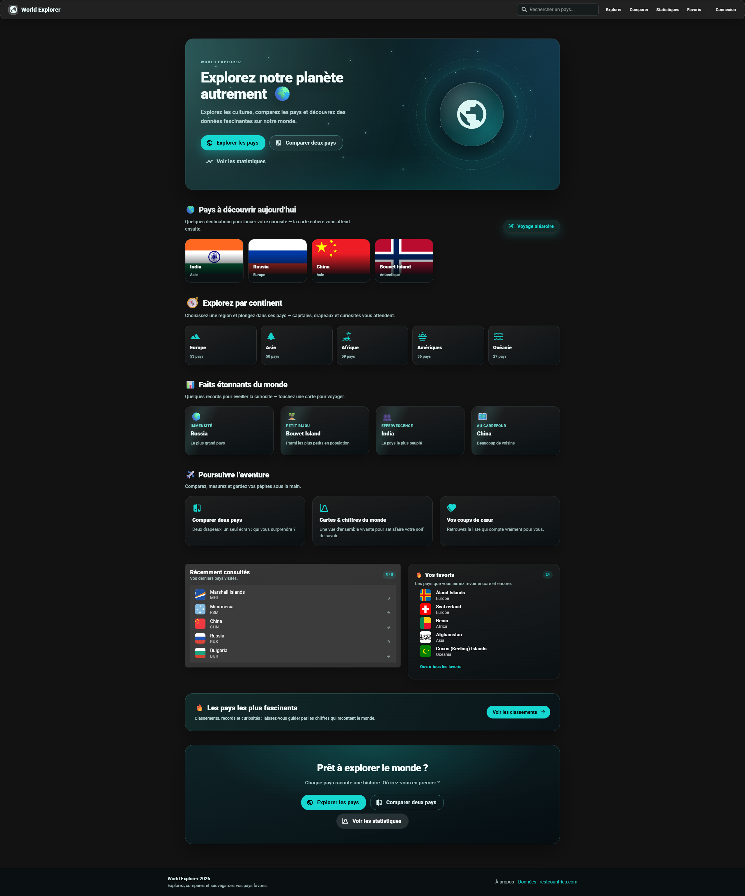
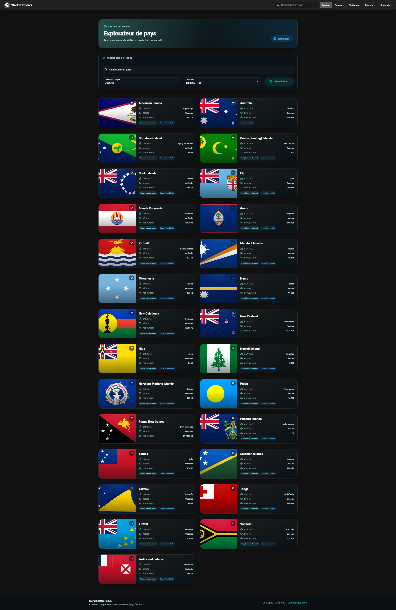
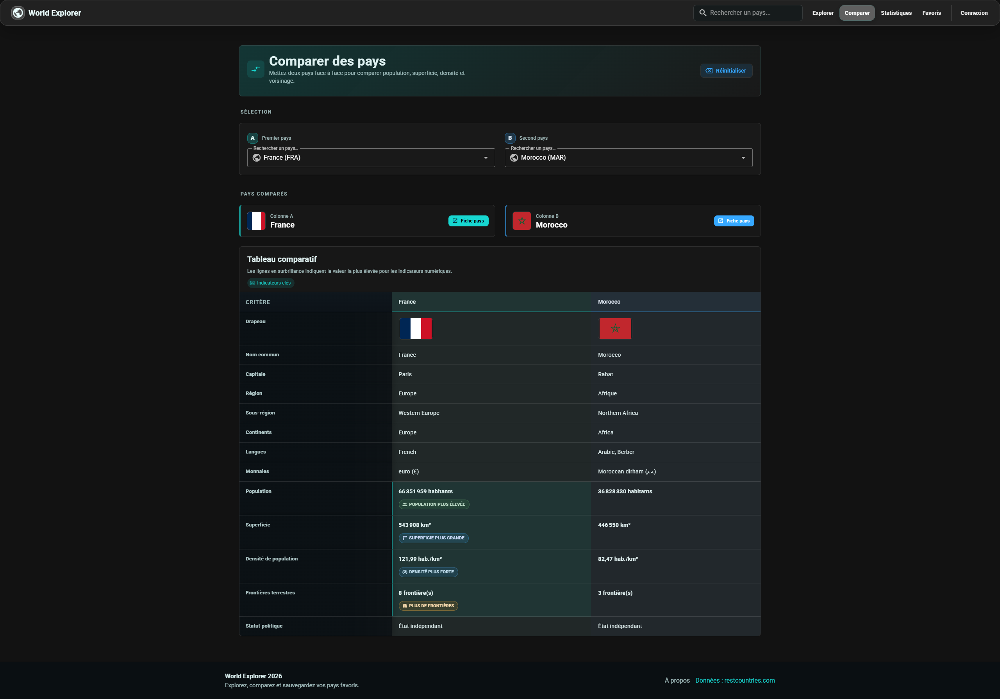
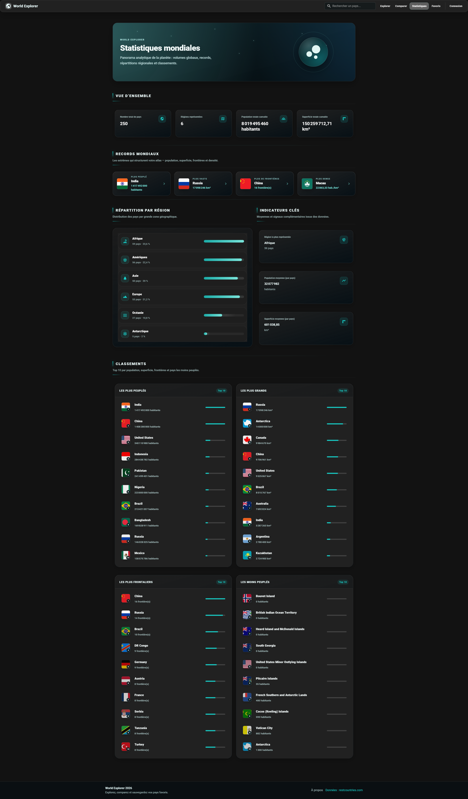
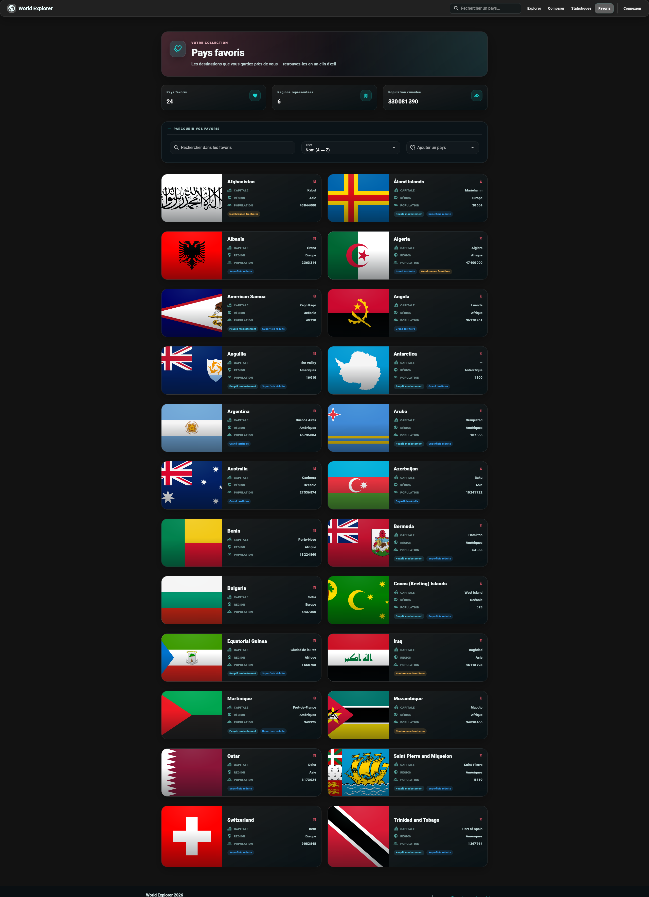

# Aperçu de l'application

## Accueil

<p align="center">
  
</p>

---

## Explorateur de pays

<p align="center">
  
</p>

---

## Comparaison de pays

<p align="center">
  
</p>

---

## Statistiques mondiales

<p align="center">
  
</p>

---

## Favoris

<p align="center">
  
</p>

---

# World Explorer

Application web moderne de **découverte et d’analyse des pays du monde**, développée avec **Vue 3** et **Vuetify 3**. Les données officielles proviennent de l’API publique [**REST Countries**](https://restcountries.com) ; l’application enrichit l’expérience avec des fonctionnalités locales (favoris, historique, comparaison, statistiques) persistées dans le navigateur.

> **Contexte pédagogique** — Projet scolaire visant à mettre en pratique une architecture front-end structurée : routing, gestion d’état, consommation d’API REST, composants réutilisables et interface responsive, sans backend ni base de données.

---

## Table des matières

1. [Présentation](#présentation)
2. [Fonctionnalités principales](#fonctionnalités-principales)
3. [Technologies utilisées](#technologies-utilisées)
4. [Installation](#installation)
5. [Variables d’environnement](#variables-denvironnement)
6. [Build et production](#build-et-production)
7. [Structure du projet](#structure-du-projet)
8. [Architecture technique](#architecture-technique)
9. [Authentification (démo)](#authentification-démo)
10. [Design responsive](#design-responsive)
11. [Bonnes pratiques](#bonnes-pratiques)
12. [Usage de l’intelligence artificielle](#usage-de-lintelligence-artificielle)
13. [Pistes d’amélioration](#pistes-damélioration)
14. [Documentation API et cartographie](#documentation-api-et-cartographie)
15. [Crédits](#crédits)

---

## Présentation

**World Explorer** est une **single-page application (SPA)** en français qui permet de :

- parcourir et filtrer une liste de pays ;
- consulter des fiches détaillées enrichies ;
- comparer deux territoires côte à côte ;
- visualiser des statistiques et classements mondiaux ;
- gérer une collection de favoris personnelle.

L’interface repose sur un **thème sombre** soigné (Vuetify 3) et s’adapte aux écrans desktop, tablette et mobile. Le nom affiché dans l’application est **World Explorer** (le paquet npm interne peut conserver le nom technique `esig-141-demo-vuetify-api`).

### Objectif éducatif

Ce projet démontre la mise en œuvre d’une application Vue.js professionnelle :

- consommation propre d’une **API REST externe** via Axios ;
- **état global** centralisé avec Pinia ;
- **navigation** déclarative avec Vue Router ;
- **persistance locale** (`localStorage`) pour les préférences utilisateur ;
- **composants réutilisables** et séparation des responsabilités.

---

## Fonctionnalités principales

| Fonctionnalité | Description |
|----------------|-------------|
| **Explorateur de pays** | Liste complète avec cartes pays, accès aux fiches et bascule favori. |
| **Recherche, filtres et tri** | Recherche textuelle, filtre par continent/région, tri par nom ou population sur la page Explorateur. |
| **Fiches pays détaillées** | Population, superficie, région, langues, monnaies, fuseaux horaires, statut politique, voisins frontaliers cliquables. |
| **Carte Leaflet interactive** | Localisation sur tuiles OpenStreetMap lorsque les coordonnées sont disponibles ; liens externes vers Google Maps et OpenStreetMap. |
| **Recherche globale** | Autocomplete dans la barre de navigation pour accéder rapidement à une fiche pays. |
| **Favoris** | Ajout/retrait depuis les cartes ou les fiches ; page dédiée avec recherche, tri avancé, ajout via autocomplete et suppression par icône poubelle. |
| **Comparaison de pays** | Sélection de deux pays (A/B) et tableau comparatif avec mise en évidence des écarts sur les indicateurs numériques. |
| **Tableau de bord statistiques** | Vue d’ensemble, records mondiaux, répartition par région, indicateurs clés et classements (top 10). |
| **Pays récemment consultés** | Historique des dernières fiches ouvertes, affiché sur l’accueil et persisté localement. |
| **Interface responsive** | Mise en page adaptative (grilles Vuetify, navigation mobile avec tiroir, tableaux scrollables). |
| **Authentification démo** | Connexion simulée côté client pour débloquer l’ajout de pays personnalisés. |
| **Pays personnalisés (admin)** | Ajout et suppression de pays fictifs stockés localement (utilisateur connecté uniquement). |
| **Page 404** | Gestion des URL inconnues. |
| **Page À propos** | Informations sur le projet et les sources de données. |

---

## Technologies utilisées

| Technologie | Rôle |
|-------------|------|
| **Vue 3** | Framework UI (Composition API, `<script setup>`) |
| **Vuetify 3** | Composants Material Design, thème, grilles responsive |
| **Vue Router 4** | Navigation, routes dynamiques, garde d’authentification |
| **Pinia** | Stores `countries` et `auth` |
| **Axios** | Client HTTP (`apiClient`) pour REST Countries |
| **Leaflet** | Carte interactive sur les fiches pays |
| **REST Countries API** | Données pays officielles (JSON) |
| **localStorage** | Persistance favoris, historique, pays custom, session démo |
| **Vite 5** | Serveur de développement et build de production |

---

## Installation

### Prérequis

- **Node.js** 18+ recommandé
- **npm**

### Étapes

```bash
# 1. Cloner le dépôt
git clone <url-du-depot>
cd World-Explorer

# 2. Installer les dépendances
npm install

# 3. (Recommandé) Configurer l'environnement
copy .env.example .env        # Windows
# cp .env.example .env        # Linux / macOS

# 4. Lancer le serveur de développement
npm run dev
```

L’application est accessible sur **http://localhost:3000** (port configuré dans `vite.config.mjs`).

---

## Variables d’environnement

Le fichier **`.env.example`** documente la variable suivante :

```env
VITE_REST_COUNTRIES_API_URL=https://restcountries.com/v3.1
```

| Variable | Description |
|----------|-------------|
| `VITE_REST_COUNTRIES_API_URL` | URL de base de l’API REST Countries (sans slash final) |

**Comportement de repli :** si `.env` est absent ou si la variable n’est pas définie, l’application utilise automatiquement `https://restcountries.com/v3.1` (valeur par défaut dans `src/services/apiClient.js`).

> Les variables Vite doivent être préfixées par `VITE_` pour être exposées au code client.

---

## Build et production

```bash
# Compiler l'application pour la production
npm run build

# Prévisualiser le build localement (optionnel)
npm run preview
```

La commande `npm run build` génère un dossier **`dist/`** contenant les assets statiques optimisés (HTML, JS, CSS). Aucun déploiement n’est configuré dans ce projet : le build sert à valider la compilation et à préparer une mise en ligne manuelle si nécessaire.

| Commande | Description |
|----------|-------------|
| `npm run dev` | Serveur de développement avec rechargement à chaud |
| `npm run build` | Build de production dans `dist/` |
| `npm run preview` | Sert le contenu de `dist/` en local |
| `npm run lint` | Analyse ESLint (nécessite une configuration ESLint valide) |

---

## Structure du projet

```
World-Explorer/
├── public/                  # Fichiers statiques servis tels quels
├── src/
│   ├── assets/              # Images et ressources (ex. drapeau pays personnalisé)
│   ├── components/          # Composants UI réutilisables
│   ├── pages/               # Vues principales (une par route)
│   ├── plugins/             # Configuration Vuetify et plugins Vue
│   ├── router/              # Définition des routes et gardes
│   ├── services/            # Client Axios et appels API
│   ├── stores/              # Stores Pinia (état global)
│   ├── styles/              # Feuilles de style globales
│   ├── utils/               # Utilitaires partagés (drapeaux, libellés régions)
│   ├── App.vue              # Shell applicatif (barre, footer, snackbars)
│   └── main.js              # Point d'entrée Vue
├── .env.example             # Modèle de configuration
├── index.html               # Page HTML racine
├── package.json
├── vite.config.mjs
└── README.md
```

### Rôle des dossiers principaux

| Dossier | Rôle |
|---------|------|
| `pages/` | Vues montées par le routeur (Accueil, Explorateur, Fiche, Favoris, Comparer, Statistiques, etc.) |
| `components/` | Blocs UI réutilisables (cartes, filtres, carte Leaflet, tableau comparatif, états chargement/erreur) |
| `stores/` | Logique métier et état partagé (pays, favoris, comparaison, auth démo) |
| `services/` | Couche d’accès à l’API REST Countries via Axios |
| `router/` | Routes nommées et protection de la page d’ajout de pays |
| `utils/` | Fonctions utilitaires transverses (URLs drapeaux, traduction des régions) |

---

## Architecture technique

### Vue Router

- Historique HTML5 (`createWebHistory`)
- Routes nommées : `home`, `countries`, `country-details`, `favorites`, `compare`, `statistics`, `about`, `login`, `add-country`, `not-found`
- Route dynamique `/countries/:code` pour les fiches pays
- Garde `beforeEach` : la route `/add-country` exige une session démo active, sinon redirection vers `/login?redirect=…`

### Pinia (gestion d’état)

**Store `countries`** — données pays, filtres, favoris, comparaison, statistiques dérivées, pays sélectionné, persistance locale.

**Store `auth`** — session démo (`login` / `logout`), persistance de l’état connecté.

Les mutations d’état passent par des **actions** dans les stores ; les composants consomment des computed et déclenchent des actions plutôt que de dupliquer la logique métier.

### Couche API (Axios)

```
Composant / Page  →  Store (action)  →  countriesService  →  apiClient (Axios)  →  REST Countries
```

- `apiClient.js` : instance Axios centralisée (`baseURL`, timeout 10 s)
- `countriesService.js` : `getAllCountries()` et `getCountryByCode(code)` avec filtrage des champs pour limiter le trafic réseau

### Composants réutilisables

Exemples : `CountryCard`, `CountryFilters`, `CountryCompareTable`, `CountryMap`, `GlobalCountrySearch`, `StatsSummaryCards`, `TopCountriesList`, `LoadingState`, `ErrorState`.

### Persistance `localStorage`

| Clé | Contenu |
|-----|---------|
| `world-explorer-favorites` | Codes ISO des pays favoris |
| `world-explorer-recently-viewed` | Derniers pays consultés (max. 5) |
| `world-explorer-custom-countries` | Pays personnalisés ajoutés localement |
| `world-explorer-auth` | Session de la démonstration d’authentification |

Les données **officielles REST Countries** restent en **lecture seule** : aucune modification n’est envoyée à l’API distante.

---

## Authentification (démo)

> **Important — à lire avant toute évaluation**

L’authentification est une **démonstration pédagogique front-end uniquement** :

- **Aucun backend** ni base de données n’est implémenté
- **Aucune sécurité réelle** : les identifiants sont comparés en clair dans le navigateur
- Identifiants de démonstration : **`admin` / `admin`**
- La session est persistée dans `localStorage` et peut être modifiée ou effacée via les outils développeur

**Ce que permet la connexion démo :**

- accéder à la page **Ajouter un pays personnalisé** (`/add-country`)
- créer et supprimer des pays fictifs stockés **localement** dans le navigateur

**Ce que la connexion ne fait pas :**

- modifier les données officielles de REST Countries
- sécuriser l’application en production
- authentifier un utilisateur côté serveur

---

## Design responsive

L’interface s’adapte aux principales tailles d’écran :

| Breakpoint | Comportement |
|------------|--------------|
| **Desktop** | Barre de navigation complète avec recherche globale, grilles multi-colonnes, cartes pays côte à côte |
| **Tablette** | Grilles adaptées (2 colonnes), barre d’outils réorganisée |
| **Mobile** | Menu hamburger (tiroir de navigation), colonnes empilées, tableaux comparatifs scrollables horizontalement |

La mise en page s’appuie sur le système de grilles **Vuetify** (`v-row` / `v-col`) et des media queries CSS complémentaires dans `src/styles/ui.css` et les styles scoped des pages.

---

## Bonnes pratiques

- **Architecture modulaire** : pages, composants, stores, services et utils clairement séparés
- **Composants réutilisables** pour limiter la duplication (cartes, filtres, états, comparaison)
- **État centralisé Pinia** pour favoris, filtres, comparaison et statistiques
- **Couche API isolée** : aucun appel Axios direct depuis les composants
- **Routing propre** : routes nommées, garde d’auth, page 404 dédiée
- **Gestion des erreurs** : états chargement/erreur explicites (`LoadingState`, `ErrorState`, alertes Vuetify)
- **Persistance locale robuste** : lecture/écriture JSON avec repli silencieux en cas d’échec
- **Code maintenable** : Composition API, utilitaires partagés (`regionLabels`, `countryFlagSrc`)

---

## Usage de l’intelligence artificielle

Ce projet a été développé avec l’assistance d’**outils d’intelligence artificielle**, utilisés de manière **transparente et encadrée** dans un contexte scolaire.

### Outils utilisés

| Outil | Usage principal |
|-------|-----------------|
| **Cursor / Claude Code** | Assistance au codage, débogage, corrections UI, revue de code et nettoyage final |
| **ChatGPT** | Aide à la documentation, idées UX/UI, structuration du projet, rédaction et amélioration du README, ingénierie de prompts |

### Périmètre de l’assistance IA

Les outils IA ont contribué à :

- accélérer certaines implémentations (composants, styles, logique Pinia) ;
- identifier des bugs et proposer des corrections ;
- améliorer la lisibilité et la cohérence du code ;
- rédiger et structurer cette documentation.

### Validation humaine

**Il est explicitement attesté que :**

- le projet a été **compris, relu et validé manuellement** par l’étudiant ;
- les **décisions techniques finales** (architecture, intégrations, comportements fonctionnels) ont été **vérifiées** avant remise ;
- l’IA a servi d’**outil d’assistance**, et non de générateur automatique aveugle ;
- les fonctionnalités décrites dans ce README **correspondent à l’état réel** du code source.

---

## Pistes d’amélioration

Évolutions réalistes hors périmètre actuel :

- **Backend réel** avec API propriétaire et persistance serveur
- **Authentification JWT** sécurisée (tokens, refresh, rôles)
- **Base de données** pour favoris et pays personnalisés multi-appareils
- **Graphiques avancés** (Chart.js, ECharts) pour les statistiques
- **Tests unitaires et d’intégration** (Vitest, Vue Test Utils)
- **Cache API** (memoization, Service Worker) pour réduire les appels réseau
- **Conteneurisation Docker** et pipeline CI/CD pour déploiement automatisé
- **Internationalisation** (vue-i18n) pour le multilingue

---

## Documentation API et cartographie

### REST Countries

- **Documentation :** [https://restcountries.com](https://restcountries.com)
- **Base URL par défaut :** `https://restcountries.com/v3.1`
- **Endpoints utilisés :**
  - `GET /all?fields=…` — liste des pays (champs limités)
  - `GET /alpha/{code}?fields=…` — détail d’un pays par code ISO (ex. `FRA`)

### Cartographie

- **Leaflet** — rendu de la carte interactive sur les fiches pays
- **OpenStreetMap** — tuiles cartographiques et lien externe vers la cartographie
- **Google Maps** — lien externe optionnel depuis la fiche pays (si URL disponible dans les données)

---

## Crédits

| Source | Usage |
|--------|-------|
| [REST Countries](https://restcountries.com) | Données pays (noms, drapeaux, population, superficie, etc.) |
| [OpenStreetMap](https://www.openstreetmap.org) | Tuiles cartographiques Leaflet |
| [Leaflet](https://leafletjs.com) | Bibliothèque de cartes interactives |
| [Vue.js](https://vuejs.org) | Framework front-end |
| [Vuetify](https://vuetifyjs.com) | Composants UI Material Design |
| [Pinia](https://pinia.vuejs.org) | Gestion d’état |
| [Axios](https://axios-http.com) | Client HTTP |
| [Vite](https://vitejs.dev) | Build tool |

**Contexte éducatif** — Projet réalisé dans le cadre d’un cours de développement web front-end, démontrant la consommation d’API REST, la gestion d’état et la construction d’une SPA moderne sans backend.

---

*World Explorer — Documentation finale — prête pour remise scolaire.*
